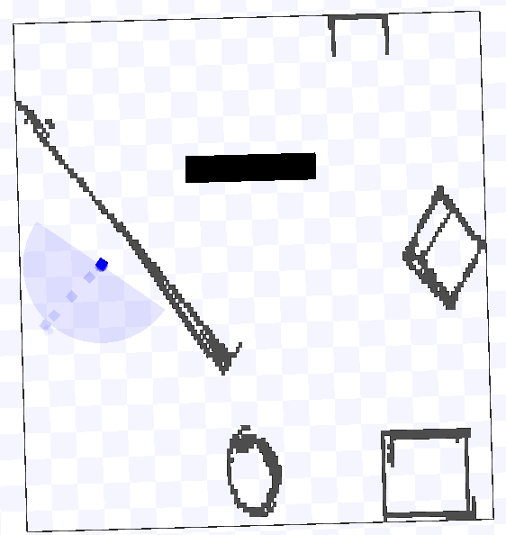

# CSE 468/568 Lab 2: Laser-Based Perception and
Navigation with Obstacle Avoidance

The objective of this assignment perform perception using a laser range finder, and
use the perceived information to avoid obstacles and navigate to a given destination.
Create a new package called lab2, and place the world files (playground.pgm and
playground.world) from the previous assignment in an appropriate sub-folder.

# Perception Using Laser Range Finder

For this section, we will implement the RANSAC algorithm to determine the walls visible" to the robot from the data obtained from the laser range finder. 
Your program should
take the laser scans as inputs and output a set of lines seen by the robot identifying the
obstacles in view.

The RANSAC algorithm is as described in class. From the set of points the laser range
finder gives, pick two at random and draw a line. Find out the distance of each of the
other points from this line, and bin them as inliers and outliers based on if the distance
is lesser or greater than a threshold distance. Repeat this for k iterations. After k
iterations, pick the line that has the most number of inliers. Drop those points, and
repeat the algorithm to the remaining set of points until you have lower than a threshold
number of points. You'll need to experiment with these parameters to find values for the
number of iterations, the threshold distance for inliers, and the threshold for the number
of points below which you cannot detect lines.

Read through the rviz tutorials. You have to read through the user guide, and built-
in data types. Then read through the first two tutorials that explain how you can use
markers.

As a demonstration of your implementation of the RANSAC algorithm, publish the
detected lines as lines that can be visualized in rviz . rviz should visualize the
detected lines in the robot's local frame. A simple way to verify that your published lines
are correct is to enable both the published lines as well as the laser scan in rviz . If
they overlap, then you are detecting the lines correctly.

Please note that rviz visualization took some time for students to set up last year.
You should get started as soon as you can. Some of rviz also depends on the graphics
hardware and processor speed you have. You can get around these limitations by
_ Not use hardware graphics rendering. You can do this by
$ export LIBGL_ALWAYS_SOFTWARE=1 in your .bashrc or on the command line where you are running the rviz node
_ reduce the frame rate so it renders at a reasonable speed. You can do this as soon
as the rviz window shows up by changing the frame rate parameter in the column
on the left. I keep it at 5 frames per second instead of the default 30 frames per
second.

# Bug2 algorithm

For this portion, you will implement the bug2 algorithm we recently learnt about. Make
the robot start at (-8.0, -2.0) and it should plan its path to (4.5, 9.0). The robot will have
to navigate itself avoiding the various obstacles in its way. Implementing bug2 should
be straight forward. The pseudocode should be on the slides from class. Your robot will
be in one of two states: GOAL SEEK and WALL FOLLOW. The key to this will be the
WALL FOLLOW where you will have to use the lines detected in the previous section
to drive in parallel to it. Please create a launch file bug2.launch that will launch the
world, run the perception node, and execute your controller.

# Output

