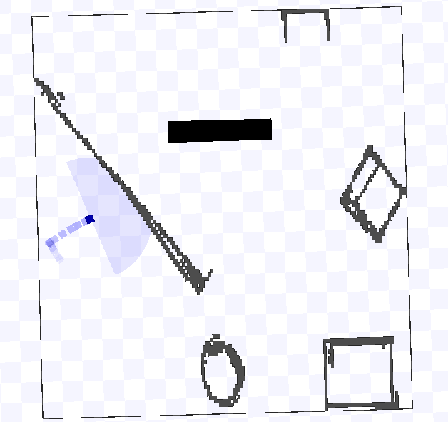

# CSE 468/568 Lab 4: A* Planning

The objective of this assignment is to plan a path for a robot from a given starting
point to a destination. Create a new package called lab4, and place the world files
(playground.pgm and playground.world) from the associated file (lab4.tar.gz) in
the appropriate sub-folder.

The objective of the assignment is simple. Use A* planning algorithm to nd a route
from a default start point (-8.0, -2.0) to a default goal (4.5, 9.0). Please go through the
tutorial on ROS Parameters. The goal should be defined as two parameters goalx and
goaly both of which should be doubles. This allows us to set a new goal parameter, and
the robot should plan a path to the new goal.

There are a couple of challenges in implementing A* planning as discussed in class.
The first challenge is to derive a graph representation of the workspace. This depends
on the map representation that the estimation block provides us. Typical examples of
such representations are occupancy grids - a grid representation with 1s and 0s with 1
indicating an obstacle in that cell and 0 representing an empty cell. For this assignment,
we have provided you such an occupancy grid. It is the file map.txt. It grids the world
as 1x1 cells. You should import this into your program as the map. You can simply
paste the array into your code and read it appropriately as a 2D matrix with dimensions
of (20, 18).

The second challenge is the heuristic for the estimated cost between the current node
and the goal. Given you know the current location and the goal, you can use Euclidean
distance between the current location and the goal as the heuristic cost. Once planned,
you should command your robot to execute the plan to go from start to goal. The
A* algorithm outputs a global path from the start node to the goal node. The global
path essentially contains a list of nodes/checkpoints, such that when the robot moves to
each one of them in succession, it will eventually reach the final goal location. ε is the
coeficient of the heuristic function, used to scale the heuristic cost. You can start with
ε = 1, and tune only if required, based on the paths returned by your A* algorithm. You
may refer to this video for a walk-through of the A* algorithm.

# Output

